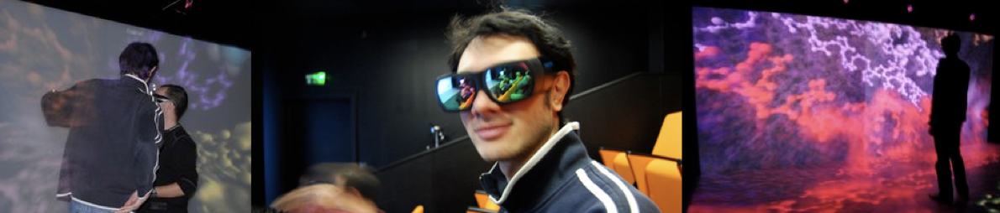

**ENGLISH VERSION** - - [CLICK ON THIS LINK TO SEE PDF VERSION](job2021a.pdf)

# Post-doctorate in immersive scientific visualization of omic data. (M / F)

## Project description

The LBT has developed original tools for the visualization and analysis of protein structures, focused on advanced environments such as virtual reality helmets and display walls. This project aims to apply and improve the Unitymol approach to computer analysis, visualization and modeling of Redox signaling networks. The purpose of this project is to develop a bioinformatics tool for the visualization of massive proteomic datasets of redox signaling networks. These are made understandable through a large and high-resolution visualization wall to analyze the network dynamics, based on quantitative and time-resolved proteomic technology allowing detection of nitrosylation and glutathionylation. Structural interpretations will be enabled through an automated modeling pipeline linking to several human mitochondrial diseases. We are seeking a highly motivated candidate to design and implement a **next generation bioinformatics visualization platform**. The candidate will develop a tool for modeling the 3D structure of all modified proteins. The generated data will feed into visualization of the redox network circuitries. We will achieve this through a graphical representation of the redox system and its temporal evolution with the possibility to explore interconnections between different systems.Project foundations were previously established (see e.g. UnityMol), providing a well-defined framework to get started. This position is a unique training opportunity in a multi-disciplinary environment combining several leading groups in academic research.

Some literature references linked to the project:

[1] Maes et al., J Integrative Bioinformatics (2018) 15, 20180006 [PDF VERSION](https://www.degruyter.com/document/doi/10.1515/jib-2018-0006/pdf)

[2] Lv et al., PLOS One (2013), 8(3): e57990 [PDF VERSION](https://journals.plos.org/plosone/article/file?id=10.1371/journal.pone.0057990&type=printable)

[3] Martinez & Baaden, Acta Cryst D (2021), D77, 746-754
[PDF VERSION](https://journals.iucr.org/d/issues/2021/06/00/qr5004/qr5004.pdf)

**Activities**
- Development of ideas and prototypes for the immersive study of redox networks and modified cysteine sites
- Development and implementation of this application in the UnityMol project, based on the Unity3D game engine.
- Application of the developed tool to concrete biological cases using the virtual reality material and the existing 3D image wall.
- write scientific articles for international peer-reviewed journals

**Skills**
knowledge:
- General knowledge of the combination of computer science and biology (bioinformatics, biophysics or chemistry).
- In-depth knowledge of molecular modeling and / or scientific / molecular visualization.
- Proficiency in scientific English (reading and writing)
- Basic knowledge of virtual reality
- Experience with game engines and similar development environments is an advantage
- Knowledge in the field of omics is an advantage

know-how
- Design and implementation of scientific software.
- Software programming and technical skills to manage developments well (tools like git, doxygen,...).
- Information analysis and retrieval skills (keeping a lab notebook, preparing results tables, preparing oral presentations).
- Preparation of articles for publication in international peer-reviewed journals.

skills
- work in a team, especially in multi-laboratory collaboration
- organise and plan your work independently;
- present results in the form of clear and detailed scientific reports.

**Context**
Most of the work will be carried out in the laboratory of Theoretical Biochemistry, a UPR 9080 unit of the CNRS led by Marc Baaden at the Institute of Physico-Chemical Biology in Paris, with regular exchanges with our partners at the University of Paris and Sorbonne University. Just over 29 people, including 15 statutory members, work in this laboratory, which is located in the heart of Latin Quarter. The project is led by Marc Baaden and Antoine Taly. The dual academic and industrial aspects are discussed. High quality material (virtual reality helmets, advanced display walls,...) will be provided. The work will be carried out in a multidisciplinary team.

**Salary** between 2,140 € and 3,954 € gross monthly according to experience
 

**Research facilities**: This LBT CNRS research unit is located in central Paris and conducts research on scientific visualization and computational biology. LBT participates in Equipex and Labex excellence in science programs. As part of the **CACSICE Equipex** , the candidate will have access to a **large high-resolution display wall**.

**About the host institute**: The &quot;Institut de Biologie Physico-Chimique&quot; was created in 1930 by the Foundation Edmond de Rothschild. It is associated with the **CNRS** (Centre National de la Recherche Scientifique), a leading international scientific institution offering an exceptional environment to scientists early in their career, with a dynamic international exposure animated by regular seminars and meetings.

**Qualification and experience**: A PhD or engineer degree in relevant fields (Computer Science, Visualization, Biophysics/Bioinformatics,..) and at least one publication in a peer reviewed journal or at a leading conference are required. The successful applicant should have excellent developer skills and a strong background in software development (graphics, shader programming, real time applications) with significant experience either in 3D visualization or in modelling, animation or game design software (Unity, Blender, Unreal). The candidate should also be familiar with at least one modern programming language. Evidence of the ability to undertake advanced software development is essential, as are good communication and organizational skills.

**Closing date:** **2nd November 2016**

Interested candidates should send a CV and a statement of research interests, including the names of three referees with contact information, as PDF document to [baaden@ibpc.fr](mailto:baaden@ibpc.fr).

**Executive summary:**

**When?**  18 months starting ASAP

**Where?** Laboratoire de Biochimie Théorique, Paris, France.

**Salary:** starting 2200 €/month for a basic level of experience; will be adjusted based on the candidate&#39;s CV
(amount indicated is before tax)

**Team Leader:** Marc Baaden - <a href="https://twitter.com/baam93" class="twitter-follow-button" data-show-count="false">Follow @baam93</a> - <a href="https://fr.linkedin.com/pub/marc-baaden/1/a5b/918" style="text-decoration:none;">&nbsp;View Marc Baaden's profile</a>

**Websites:**
* [http://www.baaden.ibpc.fr](http://www.baaden.ibpc.fr)
* [http://unitymol.sourceforge.net](http://unitymol.sourceforge.net)

**VERSION FRANCAISE**

# Post-doctorat en visualisation scientifique immersive de données omiques. (H/F)

## Description du projet

Le LBT a développé des outils originaux pour la visualisation et l'analyse des structures protéiques, porté sur des environnements avancés tels que des casques de réalité virtuelle et des murs d'affichage. Ce projet vise à appliquer et à améliorer l'approche Unitymol à l'analyse informatique, la visualisation et la modélisation des réseaux de signalisation Redox. Le but de ce projet est de développer un outil de bioinformatique pour la visualisation d'ensembles de données protéomiques massifs de réseaux de signalisation redox. Ceux-ci sont rendus compréhensibles par un grand mur de visualisation haute résolution pour analyser la dynamique du réseau, sur la base d'une technologie protéomique quantitative et résolue dans le temps permettant la détection de la nitrosylation et de la glutathionylation. Les interprétations structurelles seront activées grâce à un pipeline de modélisation automatisé reliant plusieurs maladies mitochondriales humaines. Nous recherchons un candidat très motivé pour concevoir et mettre en œuvre une plateforme de visualisation bioinformatique de prochaine génération. Le candidat disposera de modèles en structure 3D de toutes les protéines modifiées. Ces données alimenteront la visualisation des circuits du réseau redox. Nous y parviendrons grâce à une représentation graphique du système redox et de son évolution temporelle avec la possibilité d'explorer les interconnexions entre différents systèmes. Les fondations du projet ont été précédemment établies (voir par ex. UnityMol), fournissant un cadre bien défini pour commencer. Ce poste est une opportunité de formation unique dans un environnement multidisciplinaire combinant plusieurs groupes de premier plan dans la recherche universitaire.

Quelques références en lien avec le projet :
[1] Maes et al., J Integrative Bioinformatics (2018) 15, 20180006 
[2] Lv et al., PLOS One (2013), 8(3): e57990 
[3] Martinez & Baaden, Acta Cryst D (2021), D77, 746-754

**Activités**
- développer des idées et des prototypes concernant l'étude immersive des réseaux redox et des sites des cystéines modifiées
- développer et implémenter cette application dans le projet UnityMol basé sur le moteur de jeu Unity3D
- appliquer l'outil développé à des questionnements biologiques concrets en tirant profit du matériel de réalité virtuelle et du mur d'image 3D existants
- écrire des articles scientifiques pour des journaux internationaux à comité de lecture

**Compétences attendues**
savoir/connaissances:
- Connaissances générales alliant l'informatique et la biologie (bio-informatique, biophysique ou chimie)
- Connaissances approfondies en modélisation moléculaire et/ou visualisation scientifique/moléculaire
- Maitrise de l'anglais scientifique (lecture et rédaction)
- Connaissance de base en réalité virtuelle
- Une expérience préalable des moteurs de jeux et des environnements de développement similaires sera un plus
- Une connaissance du domaine des approches omiques sera un plus

Savoir Faire
- Concevoir et mettre en œuvre les logiciels scientifiques
- Capacités de programmation et d'ingéniérie logicielle pour bien gérer les développements (outils tels que git, doxygen,..)
- Capacités d'analyse et de restitution des informations (tenue d'un cahier de laboratoire, préparation de tableaux de synthèse des résultats, préparation de présentations orales).
- Préparer des articles pour publication dans des revues internationales à comité de lecture

Savoir-être
- travailler en équipe, notamment en collaboration multi-laboratoire,
- organiser et planifier son travail de manière autonome;
- présenter ses résultats sous forme de rapports scientifiques clairs et circonstanciés.

**Salaire** entre 2 140 € et 3 954 € bruts mensuels selon expérience

**Contexte de travail**
Le travail sera effectué en majeure partie dans le laboratoire de Biochimie Théorique, unité UPR 9080 du CNRS dirigé par Marc Baaden à l'Institut de Biologie Physico-Chimique à Paris, avec des échanges réguliers avec nos partenaires à l'université de Paris et Sorbonne Université. Ce laboratoire, situé au cœur du quartier latin regroupe un peu plus de 29 personnes dont 15 membres statutaires. Le projet se fera sous la direction de Marc Baaden. Du matériel haut de gamme (casques de réalité virtuelle, mur de visualisation avancé,..) seront mis à disposition. Le travail s'effectuera dans une équipe pluri-disciplinaire.

**Installations de recherche**: Cette unité de recherche LBT CNRS est située dans le centre de Paris et mène des recherches sur la visualisation scientifique et la biologie informatique. LBT participe à l'excellence Equipex et Labex dans les programmes scientifiques. Dans le cadre du ** CACSICE Equipex **, le candidat aura accès à un ** grand mur d'affichage haute résolution **.

** A propos de l'institut hôte **: L'Institut de Biologie Physico-Chimique a été créé en 1930 par la Fondation Edmond de Rothschild. Il est associé au ** CNRS ** (Centre National de la Recherche Scientifique), une institution scientifique internationale de premier plan offrant un environnement exceptionnel aux scientifiques au début de leur carrière, avec une exposition internationale dynamique animée par des séminaires et des réunions réguliers.

** Qualification et expérience **: un doctorat ou un ingénieur dans les domaines pertinents (informatique, visualisation, biophysique / bioinformatique,..) et au moins une publication dans une revue à comité de lecture ou lors d'une conférence de premier plan est requise. Le candidat retenu doit avoir d'excellentes compétences de développeur et une solide expérience dans le développement de logiciels (graphiques, programmation de shader, applications en temps réel) avec une expérience significative soit dans la visualisation 3D, soit dans les logiciels de modélisation, d'animation ou de conception de jeux (Unity, Blender, Unreal). Le candidat doit également connaître au moins un langage de programmation moderne. La preuve de la capacité d'entreprendre un développement logiciel avancé est essentielle, tout comme une bonne communication et des compétences organisationnelles.

** Date de clôture: ** ** 2 novembre 2016 **

Les candidats intéressés doivent envoyer un CV et une déclaration des intérêts de recherche, y compris les noms de trois arbitres avec les coordonnées, comme document PDF à [baaden@ibpc.fr] (mailto:baaden@ibpc.fr).

** Résumé: **

**Quand?** 18 mois à compter du plus tôt possible

**Où?** Laboratoire de Biochimie Théorique, Paris, France.

** Salaire: ** à partir de 2200 € / mois pour un niveau d'expérience de base; sera ajusté en fonction du CV du candidat
(le montant indiqué est avant impôt)

** Chef d'équipe: ** Marc Baaden - <a href = "https: //twitter.com/baam93" class = "twitter-follow-button" data-show = "false"> Follow @ baam93 </ a> <script async src = "

** Sites Web: **
* [http://www.baaden.ibpc.fr] (http://www.baaden.ibpc.fr)
* [http://unitymol.sourceforge.net] (http://unitymol.sourceforge.net)

